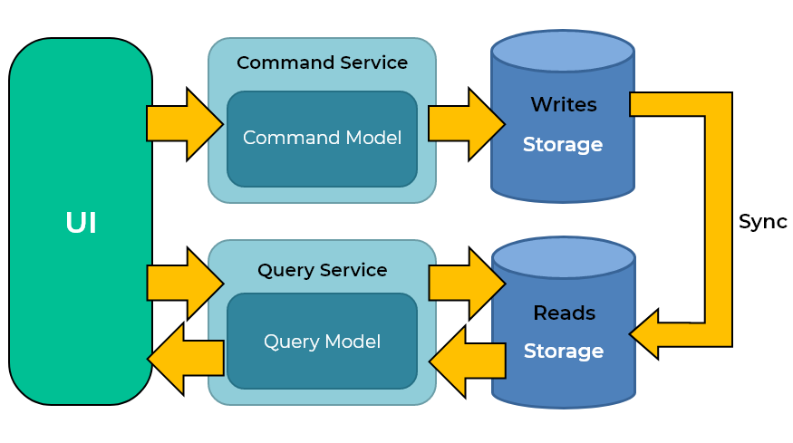

CQRS is a design pattern that segregates read and write workloads into two separate models, aiming to improve query latency and scalability. Reads and writes have different performance profiles, and when they share the same model — as in a traditional CRUD system — they can contend for the same resources.

CQRS introduces eventual consistency between write side and read side. 

