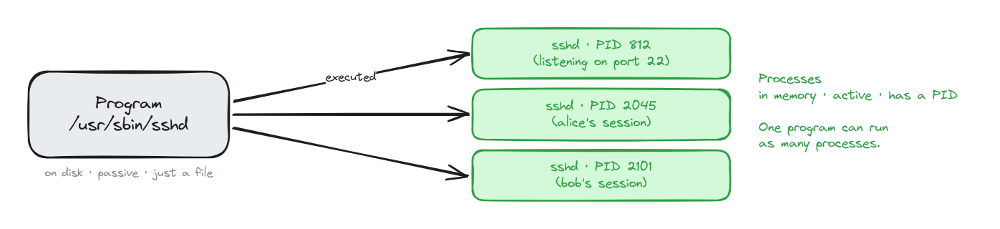
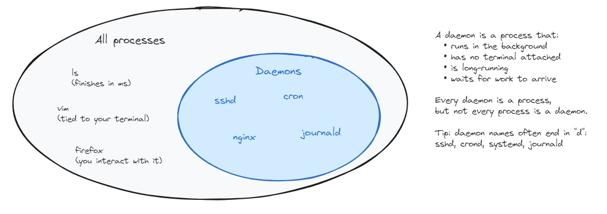
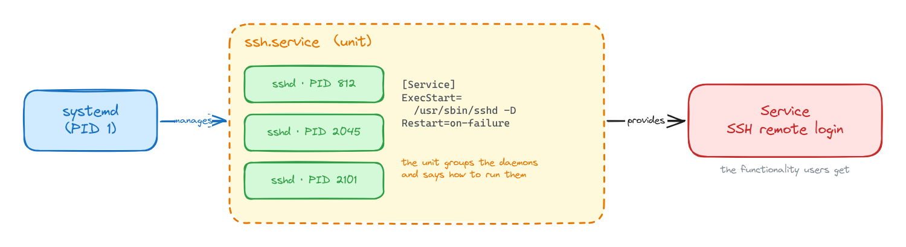
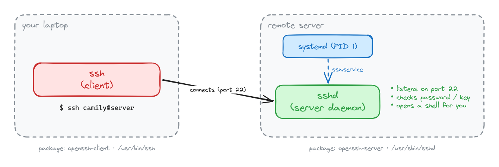
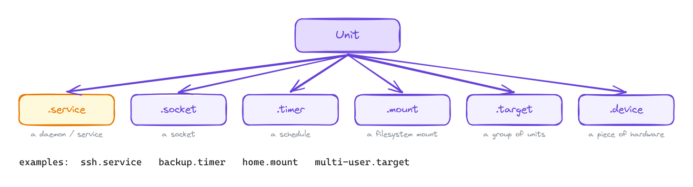
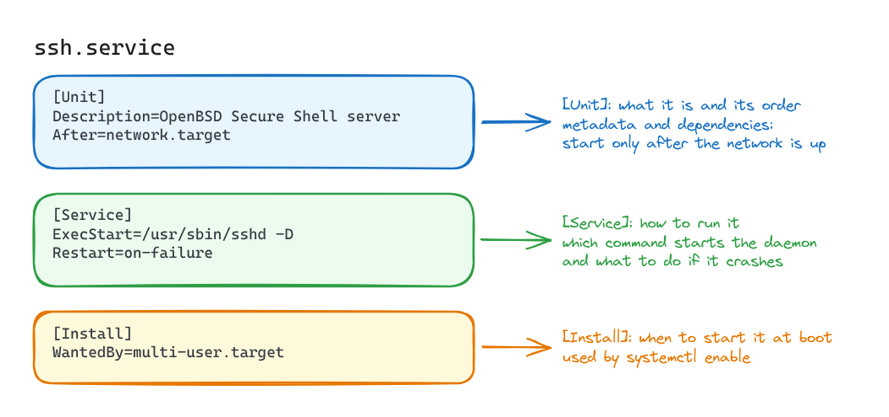
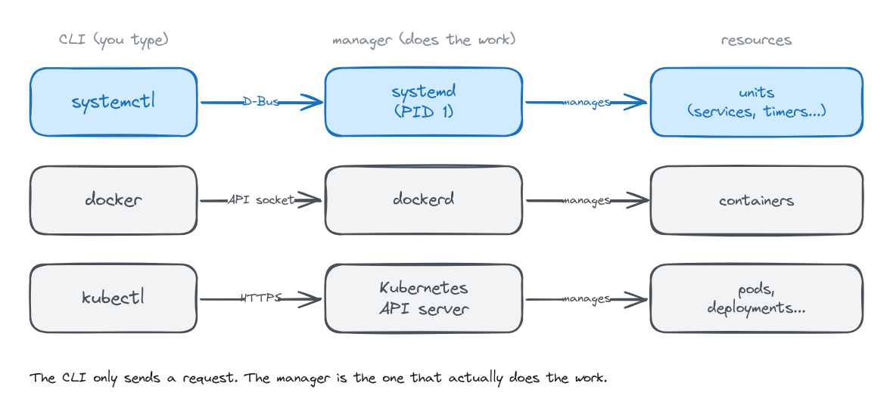
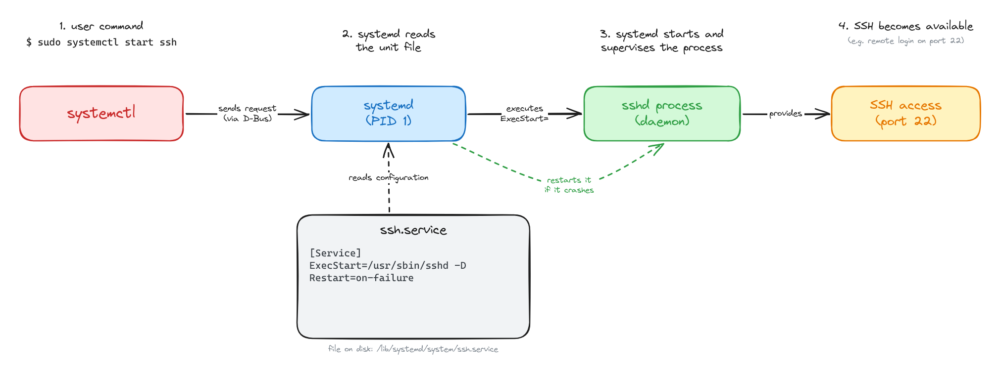

When I started using Vagrant (a VM orchestrator), some weird commands like `systemctl` kept appearing, and they made me curious about what they were and how they worked. Diving deeper into my research, I discovered something called `systemd`.

**"WHAT THE HELL IS SYSTEMD"?** I asked myself calmly. 

So, I’m writing this up to try to make a little sense of this weird manager, with a special focus on the part I kept running into the most: **services**.

### Starting point: systemd 

`systemd` is an **open-source project** that provides a **system and service manager** used by many Linux distributions. It is responsible for managing many parts of the system's userspaces and coordinating the boot process.

When the system boots, the **Linux kernel** starts the first userspace process. On a systemd-based distribution, this process is `systemd`, which runs as **PID 1**.

From that point on, `systemd` is responsible for bringing the userspace system up and coordinating many system components. Among other things, it can:

- start and supervise services;
- mount filesystems;
- manage dependencies between system components;
- activate sockets and timers;
- coordinate devices and targets;
- work with companion components such as `systemd-networkd` and `systemd-journald`, when they are used.

Notice that the first item on that list is **services**. But, Camily, what is the definition of a service on Linux?

## What is a service and some terms

A Linux service is a system function or capability provided by one or more processes, usually without direct user interaction.

A service is often implemented by a background process that we call a **"daemon"**.

In `systemd`, services are managed through service units. A service unit is one specific type of `systemd` unit, identified by the `.service` extension, such as `ssh.service`.

So, the **service** is the functionality being provided, while the **service unit** is the object that `systemd` uses to describe and manage that service.


Notice that there is an important distinction between a **program**, a **process**, a **daemon**, and a **service**. So let's clarify some terms:

- **Program**: executable code stored on disk, for example `/usr/sbin/sshd`.
- **Process**: a running instance of a program.
- **Daemon**: a process designed to run in the background, usually for a long period of time.
- **Service**: the functionality being provided, usually by one or more daemon processes.
- **systemd unit**: a generic object representing something that `systemd` knows how to manage.

The first two are easy to see: the program is just a file on disk, and every time it is executed, the kernel creates a new process from it, with its own PID. One program can even run as many processes at the same time: `sshd`, for example, creates a new child process for each SSH connection.                                                        


<center>Fig 1: one program, many processes</center>

**"I don't get the difference between a daemon and a process!"**

A daemon **is a process**.

The term **_process_** describes what it is from the operating system's perspective: a running instance of a program.

The term **_daemon_** describes the **role and behavior** of that process: it usually runs in the background and provides some persistent functionality.

For example, when `/usr/sbin/sshd` is executed, the kernel creates an `sshd` process. Because that process runs in the background waiting for SSH connections, we call it a daemon. (That's also where the name comes from: the "d" in `sshd` stands for daemon.)


<center>Fig 2: every daemon is a process, but not every process is a daemon</center>

And the `sshd` processes together provide the **service**: SSH remote login. But `systemd` doesn't manage that service directly. It manages it through a **unit**, in this case `ssh.service`,which describes how that service should run.


<center>Fig 3: from daemon to service to unit</center>

**"Wait, if the daemon is `sshd`, why is the unit called `ssh`?"**

Because the unit name is just a naming choice of each distribution. On Debian and Ubuntu, the unit is called `ssh.service`, but it runs `sshd`. That's why the command is 

```bash
systemctl start ssh
```

even though the process you see in `ps` is `sshd`.

On Fedora, RHEL and Arch, the unit is called `sshd.service`, so the names match.

But notice that `ssh` and `sshd` are two different programs, even though both are part of SSH. `ssh` is the client: it runs on the machine that initiates the connection, such as your host. `sshd` is the server daemon: it runs on the machine accepting SSH connections and waits in the background for clients to connect.

A machine can have both programs installed, so depending on the situation, it can act as an SSH client, an SSH server, or both.

In this example, `ssh` is the client running on the host machine, while `sshd` is the server daemon running on the remote machine.


<center>Fig 4: ssh is the client, sshd is the server daemon</center>

| | `ssh` | `sshd` |
|---|---|---|
| Role | client | server (daemon) |
| Where it runs | on **your** machine | on the **remote** machine |
| What it does | connects to another machine | waits for connections and accepts them |
| How it runs | you run it when you need it, then it exits | runs in the background all the time, started by `systemd` |
| Binary | `/usr/bin/ssh` | `/usr/sbin/sshd` |
| Package (Debian/Ubuntu) | `openssh-client` | `openssh-server` |

For example, when you type: 

```bash
ssh camily@server
```

the `ssh` process on your laptop connects to the `sshd` daemon on the server, which checks your password or key and opens a shell for you.

That's why I like SSH as an example: it shows a **program**, a **process**, a **daemon**, a **service** and a **unit**, each one with a slightly different name.

## systemd units and its relation to services

All the resources and objects that `systemd` manages are represented through the abstraction of a **unit**. A unit is the basic management object in `systemd`, and different unit types represent different kinds of system resources or behaviors. A service is only one of them.

Each unit type has a specific purpose. For example, a `.service` unit describes a service, a `.timer` unit represents scheduled activation, and a `.mount` unit represents a filesystem mount.


<center>Fig 5: unit types</center>

Most units are defined by **unit files**, which are configuration files named `name.type`, where the extension tells you the unit type:

```ini
ssh.service
backup.timer
home.mount
multi-user.target
```

To declare a **service unit** configuration file, we can do something like this:

```ini
[Unit]
Description=OpenBSD Secure Shell server
After=network.target

[Service]
ExecStart=/usr/sbin/sshd -D
Restart=on-failure

[Install]
WantedBy=multi-user.target
```

Each section has a different job:

- `[Unit]` **describes the unit and its dependencies**. In other words, it contains general information about the unit and defines its relationships or dependencies with other units.
- `[Service]` **says how to run the daemon**. In other words, it describes how `systemd` should start, stop, restart, and manage the service process.
- `[Install]` **defines how the unit should participate in boot when enabled**. In other words, it describes how the unit should be connected to other units when we run `systemctl enable`, for example through `WantedBy=multi-user.target`.


<center>Fig 6: anatomy of a service unit file</center>

Unit files usually live in two main places inside the Linux distribution:

- `/lib/systemd/system/` or `/usr/lib/systemd/system/` — this is where unit files installed by packages usually live, such as `ssh.service`.

- `/etc/systemd/system/` — this is where your own configuration lives, including units you create and overrides for existing ones.

The important thing to know is that files under `/etc/systemd/system/` take priority over the package-provided versions.

This lets you customize how a service behaves without editing the original unit file installed by the package.  That is useful because package updates may replace files under `/usr/lib/systemd/system/`, while your local configuration stays separate.

For example, when working with Vagrant, we may want a service to run inside the VM, such as SSH, a web server, or our own application.

We might want that service to start automatically when the VM boots, wait until the network is ready, run a specific command, or restart if it crashes.

If we change the service configuration by editing its unit file, `systemd` will still use the configuration it already has loaded. It will not automatically notice that the file changed or start using our customized version until we tell it to reload the unit files.

So we need a way to tell it:

> “Hey, the unit configuration changed. Read it again.”

For that, we can use:

```bash
sudo systemctl daemon-reload
```

`daemon-reload` tells `systemd` to reload its unit files and update the configuration it knows about.

This is actually where I started wondering about `systemctl` command.

While working with Vagrant, I kept running commands like:

```bash
systemctl daemon-reload
systemctl status ssh
systemctl restart ssh
```

and at some point the obvious question appeared: what exactly is `systemctl` doing here?

Services are being managed by `systemd`, and units describe how those services should be handled. But there still needs to be some way for us to send instructions to that manager, in this case the `systemd`

If we want a service to start, stop, restart, or simply tell us what state it is in, how do we ask `systemd` to do that?

## How to interact with services?

That is what `systemctl` is for.

`systemctl` is the CLI we use to interact with `systemd`.

A CLI itself is not doing the underlying work. Instead, it sends a request to a **manager**, and that manager is responsible for controlling the actual resources. At a high level, it follows the same pattern as tools like `kubectl` or the Docker CLI.

In this case, `systemctl` sends commands to `systemd`, and `systemd` manages the units behind them.
 `


<center>Fig 7: the CLI sends a request, the manager does the work</center>

At this point, we already have all the pieces: a daemon (`sshd`), a service (SSH), a unit (`ssh.service`), and a way to interact with `systemd` to manage them.

Since many services are implemented by long-running daemon processes, using `systemctl` basically means controlling their lifecycle: starting them, stopping them, restarting them, or simply checking what state they are in.

That is exactly what `systemctl` gives us:

```bash
sudo systemctl start ssh     # start the service now
sudo systemctl stop ssh      # stop it
sudo systemctl restart ssh   # stop it and start it again
systemctl status ssh         # is it running? also shows the latest logs
```

Those commands define what should happen to the service **right now**: start it, stop it, restart it, or simply check its current state.


Putting it all together, this is what happens when you start the SSH service:


<center>Fig 8: what happens when you run systemctl start ssh</center>

But there is another question we also need to answer:

**What should happen to this service when the machine starts again?**

This becomes especially important when we are working with something like Vagrant. Every time we bring a VM up, the guest operating system has to start again.

That startup process is what we call **boot**.

The machine starts, the Linux kernel is loaded, `systemd` starts as PID 1, and then the rest of the userspace system begins to come up.

And now we have a new problem.

If I run:

```bash
systemctl start ssh
```

only changes what is happening **right now**.

The SSH service starts, great.

But what happens the next time we destroy, restart, or bring the VM up again?

Do I have to manually run `systemctl start ssh` every single time? Or should SSH start automatically? 

So there is another kind of state we need to care about: the **boot state**. It defines what should happen to the service when the system boots again. In other words, it tells `systemd` whether that service should be started automatically during boot.

And this is exactly why we have `enable` and `disable`:

```bash
sudo systemctl enable ssh         # start at boot
sudo systemctl disable ssh        # don't start at boot
sudo systemctl enable --now ssh   # both: enable it and start it now
```

To understand what `enable` actually does, we need to introduce another kind of `systemd` unit: a **target**.

A target is basically a unit that groups other units together around a certain system state or purpose.

For example, `multi-user.target` represents a normal multi-user system state where the machine has finished most of its boot process and services such as networking, SSH, cron, and other background services can be running.

So instead of imagining the boot process as one giant list of commands executed from top to bottom, it is better to think of `systemd` as activating units and following their dependencies until the system reaches a desired target.

And now the `[Install]` section from our service unit starts to make more sense:

```ini
[Install]
WantedBy=multi-user.target
```

This tells `systemctl`:

> When this service is enabled, associate it with `multi-user.target`.

So when we run:
```bash
sudo systemctl enable ssh
```

`systemctl` creates the appropriate symbolic links so that `ssh.service` becomes part of the dependency structure associated with `multi-user.target`.

Then, the next time the system boots and `systemd` activates `multi-user.target`, `ssh.service` can be pulled in as part of that process.

So we can think about a service as having two different kinds of state: its **runtime state** and its **boot state**.

The important thing to keep in mind is that `start` and `enable` are different operations.

`start` tells `systemd` to run the service **now**.

`enable` configures the service to be started **during boot**.

This also explains why a service can be both:

```text
active + disabled 
```
or 
```text
inactive + enabled
```

At first, that sounds a little weird.

But it makes sense once we remember that those two states describe different things.

A service can be running **right now** without being configured to start again during the next boot.

And a service can be configured to start during boot while still being **inactive right now**.

Alright.

But what if I start a service and it fails? How can I check the runtime state? 


### What is the service doing? Debugging services

The first thing we can do is ask `systemd` for the current state of the service:

```bash
systemctl status ssh
```

This tells us whether the service is active, inactive, failed, or in some other state, and also shows some recent information about what happened.

But knowing that a service **failed** is not always enough. We also want to know **why** it failed. For that, `systemd` has another component called `systemd-journald`.

`systemd-journald` is a **daemon** that runs in the background and collects log messages from different parts of the system, including services managed by `systemd`.

Instead of every service necessarily writing its output into its own log file, many services send their logs to the **system journal**, which is the log storage maintained by `journald`.

So we have two different things here:

`systemd-journald` is the **daemon that collects and stores the logs**.

`journalctl` is the **CLI we use to read and query those logs**.

For example:

```bash
journalctl -u ssh      # all the logs of ssh.service
journalctl -u ssh -f   # follow new logs in real time
```

The `-u` option means **unit**, so this command shows the journal entries associated with `ssh.service`.

The `-f` option means **follow**, which lets us watch new log entries as they are generated.

So, in the same way that `systemctl` is the CLI we use to interact with `systemd`, `journalctl` is the CLI we use to interact with the logs collected by `systemd-journald`.


And suddenly those weird commands I kept seeing inside my Vagrant VM start to make a lot more sense.


Sure there is a lot of content to talk about `systemd`, but I will let space for other posts. 

Thank you! 

~ Cami 


---

## References

https://systemd.io/
https://www.freedesktop.org/software/systemd/man/latest/systemd.html
https://www.freedesktop.org/software/systemd/man/latest/systemd.unit.html
https://www.freedesktop.org/software/systemd/man/latest/systemd.service.html
https://www.freedesktop.org/software/systemd/man/latest/systemd.special.html
https://www.freedesktop.org/software/systemd/man/latest/systemctl.html
https://www.freedesktop.org/software/systemd/man/latest/journalctl.html
https://wiki.archlinux.org/title/Systemd
https://en.wikipedia.org/wiki/Systemd
https://man.openbsd.org/sshd
